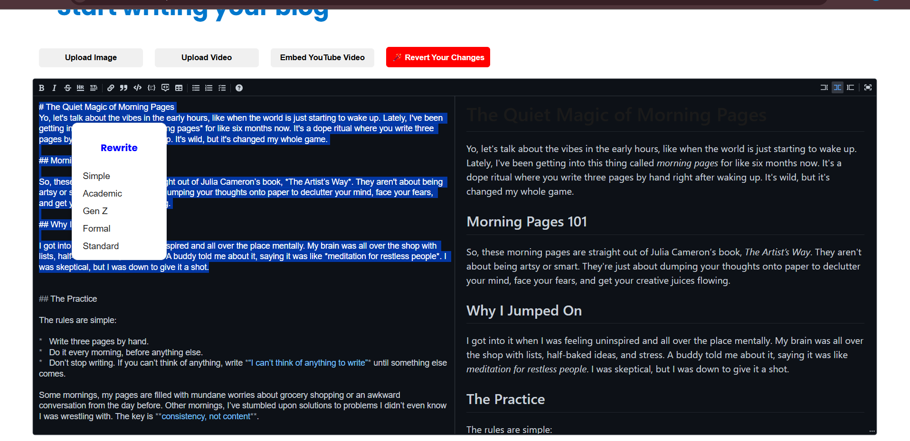

# Blogger

Built using React, Node.js, Express.js, and integrated with AWS services like DynamoDB, S3, and Cognito. This web application allows users to write and preview blogs in Markdown, embedding images, videos, and YouTube links. It also provides social features, enabling users to follow and unfollow other users, like and unlike posts, as well as comment and uncomment content. The app leverages AWS services for authentication (via Cognito) and content storage (using DynamoDB for the database and S3 for media storage). The app also comes with AI writing tools to customise the writing style and a cosine similarity based recommendation system for similar blogs and to personalise a user's home feed. 

The app is set-up with a CI-CD pipeline using Github Actions and deployed on AWS.

### Front-End

Traverse to the /blogger-frontend folder using the command  
`cd blogger-frontend`

then the command  
`npm i` 
to install all the dependencies for the react project.

Then create the .env file in the blogger-frontend folder

```
VITE_REGION=''
VITE_AWS_ACCESS_KEY_ID=''
VITE_AWS_SECRET_ACCESS_KEY=''
VITE_BUCKET=''
VITE_REACT_APP_API_URL='http://localhost:5000/api'
VITE_COGNITO_POOL_ID=''
```

then run the frontend using the command  

`npm run dev`


### Backend

This part uses Node.js, Express.js.
So make sure you have Node.js installed on your system.

Traverse to the /backend folder  

`cd backend`

then install the necessary dependencies using  

`npm i`

then create a .env file containing the necessary api keys

```
USER_POOL_ID=''
CLIENT_ID=''
PORT=5000
JWT_SECRET=''
REGION=''
AWS_ACCESS_KEY_ID=''
AWS_SECRET_ACCESS_KEY=''
OPEN_AI_KEY=''
PINECONE_API_KEY=''
REACT_URL=''
```

the variable `PORT` is set up as the port you want to run the backend in
the variable `JWT_SECRET` is a random string that you use for the JWT authentication.

once done you can run the backend using the command  

`nodemon app.js` or `npm run dev`


### Cross - Env Setup

```json
  "scripts": {
    "start": "cross-env NODE_ENV=production node index.js",
    "dev": "cross-env NODE_ENV=development nodemon index.js",
    "test": "cross-env NODE_ENV=test jest",
    "test:watch": "cross-env NODE_ENV=test jest --watch"
  }
```

`cross-env` library can be used to dynamically setup environments. This is used to run the app in different envs without writing extra or redundant code and can be determined using env vars.

### AI Writing tool

The AI writing tool is integrated using OpenAI's GPT-3.5-turbo model. To use this feature, all you need to do is select a section of text while writing your blog in markdown window and `right-click` to open the custom options menu where you can see a bunch of predefined styles in which it can rewrite your content. Simply click on that to generate the new content. You can revert your changes by clicking the `revert your changes` button. Each session is limited to 5 rewrites.

<div align="center">
    
</div>


### Recommendation System

The recommendation system works using embeddings and cosine similarity. Every blog submission is indexed into Pinecone database by making an embedding of the concatenated string of plaintext content and the selected tags. 

So whenever an user visits a blog we basically create this embedding again and then query Pinecone for 3 most similar blogs (based on content and tags) using the K-Nearest Neighbours algorithm. These are displayed as recommendations.

The user's home feed is also personalised to the user's interests. This involves pagination with infinite loading in the frontend. Each page shows 5 blogs at once.

<div align="center">
    
</div>

<div align="center">
    
</div>

`Page 0` displays blogs belonging to the authors whom we follow. 

`Page 1-n` we display blogs using the combination `3 blogs based on cosine similarity and 2 random`.

This combination ensures proper visibility of our favourite authors and also similar blogs ensuring balance.

```jsx

const pinecone=require('@pinecone-database/pinecone')
const OpenAI=require('openai')

const openAI= new OpenAI({
    apiKey:process.env.OPEN_AI_KEY
})
const pc=new pinecone.Pinecone({
    apiKey:process.env.PINECONE_API_KEY
})
const index=pc.Index('blogs')
```

here is the setup for pinecone and openAI.


